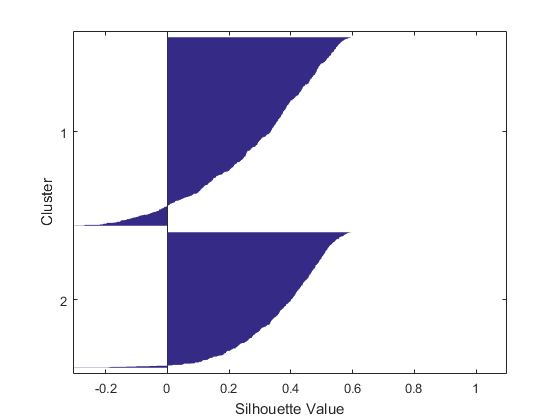
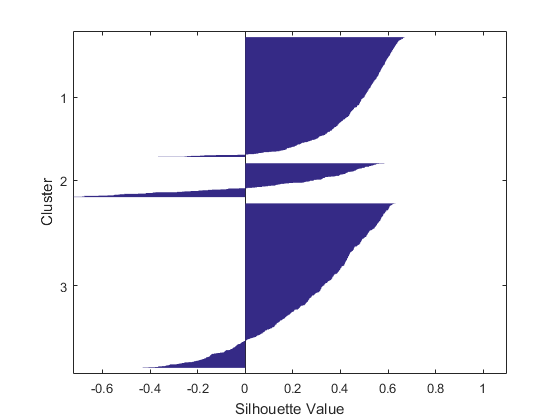

# Interpreting the Clusters

Author: Zhaojicheng Zhou

---

## Menu

1. Function `parallelcoords`
2. Cross Tabulation
3. Evaluating Cluster Quality

### Function `parallelcoords`

When there are several variables in the observation, function `parrallelcoords` to visualize the variable value.

- Inputs:

    |X|"Group"|g|
    |---|---|---|
    |Data, specified as a numeric matrix.|Property name.|A vector containing the observations' group or cluster identifiers.|

Sample Code:  

```matlab
parallelcoords(X,"Group",g)
```

### Cross Tabulation

- Function `crosstable`

    In some data sets, the observations already have a category associated with them. You can use the crosstab function to study the distribution of clusters across the original categories.
- Function `heatmap`

    You can use the heatmap function to visualize the counts.

### Evaluating Cluster Quality

- Introduction:

    When using clustering techniques such as k-means and Gaussian mixture models, you have to specify the number of clusters. However, for high-dimensional data, it is difficult to determine the optimum number of clusters.

    You can use the silhouette values to judge the quality of the clusters. An observation’s silhouette value is a normalized measure (between -1 and +1) of how close that observation is to other observations in the same cluster, compared to the observations in different clusters.

- Silhouette Plots:

    A silhouette plot shows the silhouette value of each observation, grouped by cluster. Clustering schemes in which most of the observations have high silhouette value are desirable.

    Sample Code:

    ```matlab
    [grp,c] = kmeans(X,2);
    silhouette(X,grp)

    [grp,c] = kmeans(X,3);
    silhouette(X,grp)
    ```

    The first figure:

    

    The second figure:

    

- Automate Cluster Quality Evaluation

    Instead of manually experimenting with different numbers of clusters, you can automate the process with the evalclusters function.

    The following function call creates 2, 3, 4, and 5 clusters using k-means clustering, and calculates the silhouette value for each clustering scheme.

    ```matlab
    clustev = evalclusters(X,"kmeans","silhouette","KList",2:5)
    ```

    The output variable, clustev, contains detailed information about the evaluation including the optimum number of clusters.

    ```matlab
    kbest = clustev.OptimalK
    ```
