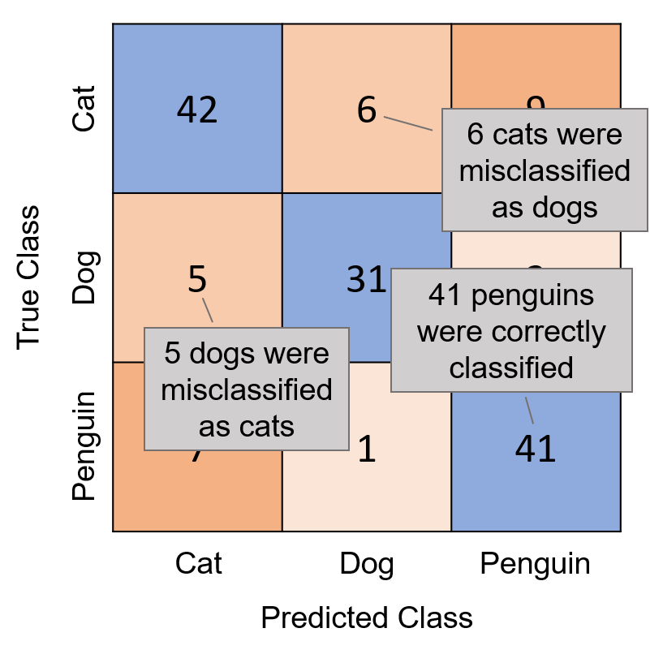

# Chapter0

Theme: The basic ploting and application of the machine learning

---

## Menu

1. Theory
2. Plot function
3. Evaluation function

---

## Theory

### kNN model

kNN model is called K- Nearest Neighbor model. [more detailed information is here](https://anl.sjtu.edu.cn/mcm/docs/name/K邻近)

### confusionchart

Confusion chart is used to evaluate the effectiveness of the model in a more detailed way.

---

## Plot Function

### gscatter

- Descriptioin
    > The `gscatter` can create a scatter plot of different color according to the corresponding variable
- Instruction
   > Basically, the `gscatter` recieves three parameters:
        >>
        >> 1. x value
        >> 2. y value
        >> 3. the corresponding variable

---

## Built-in Function

- **fitcknn()**
  - Description
      > `fitcknn()` is a function based on the kNN model
  - Built-in Function
      > `fitcknn()` generate a knn model. The `fitcknn()` receives three parameters:
          >>
          >> 1. The table of the data set
          >> 2. Response VarName  
          >> 3. Option which can tail a corresponding parameter behind

- **predict( )**
  - Desciption
    > `predict()` create an expected class based on the model
  - Instruction
    > `predict` recieves two parameters:
        >>
        >> 1. the model
        >> 2. newdata

- **confusionchart**
  - Description
    > `confusionchart()` create a confusion chart
  - Instruction
    > `confusion char()` receives two parameters:
        >>
        >> 1. known data
        >> 2. predicted data
