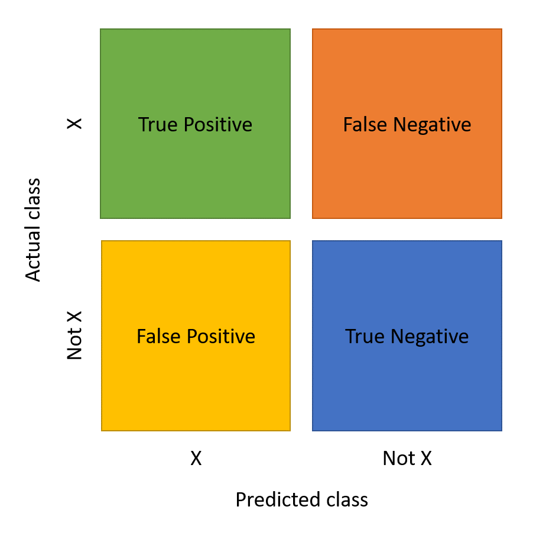
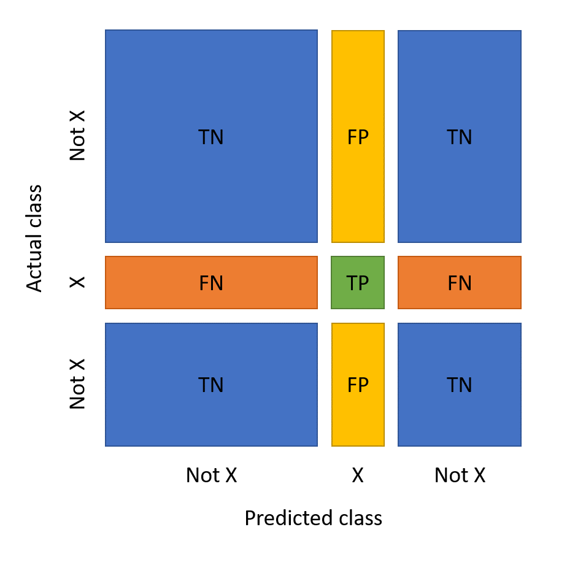

# Chapter3

Theme: Training and Testing Data

## Menu

1. How to Choose the Model
2. Making Predictions
3. Investigating Misclassifications

---

### How to Choose the Model

click [here](https://matlabacademy.mathworks.com/R2022b/portal.html?course=machinelearning#chapter=5&lesson=2&section=1) to get more information.

---

### Making Predictions

|function|description|
|---|---|
|loss| Loss is a fairer measure of misclassification that incorporates the probability of each class (based on the distribution in the data)|
|resubloss|determine the loss of the original training data|

---

### Investigating Misclassifications

#### Identifying Common Misclassifications

1. How to read confusion matrix

&emsp;&emsp;&nbsp;**simple case**

&emsp;&emsp;&nbsp;

>For any response class X, you can divide a machine learning model's predictions into four groups:
>
>- True positives (green) – predicted to be X and was actually X
>- True negatives (blue) – predicted to be not X and was actually not X
>- False positives (yellow) – predicted to be X but was actually not X
>- False negatives (orange) – predicted to be not X but was actually X

<br/>

&emsp;&emsp;&nbsp;**multiple-class case**

&emsp;&emsp;&nbsp;

>With multiple classes, the false negatives and false positives will be given by a whole row or column of the confusion matrix (except for the diagonal element that represents the true positive).

2. Demostration

```matlab
%load the file and initialize
load letterdata.mat
load predmodel.mat
testdata
predLetter
confusionchart(testdata.Character,predLetter);

%Recreate the confusion chart with normalized row summary information
confusionchart(testdata.Character,predLetter,"RowSummary","row-normalized");

%Use relational and logical operators to create a logical array that identifies instances of the test data where the letter U was classified as something else.
falseneg = (testdata.Character == "U") & (predLetter ~= "U");

%determine the file names of the observations that were incorrectly classified as the letter U. Store the result in a variable called fnfiles.
%Similarly, use falseneg as an index into predLetter to determine the associated predicted letters. Store the result in a variable called fnpred.
fnfiles = testfiles(falseneg);
fnpred = predLetter(falseneg);

%Use the readtable function to import the data in the fourth element of fnfiles into a table called badU. Visualize the letter by plotting Y against X.
badU = readtable(fnfiles(4));
plot(badU.X,badU.Y)
```

#### Investigating Features

removecats: remove the unused categories

A parallel coordinates plot shows the value of the features (or “coordinates”) for each observation as a line.  
`parralelcoords`
