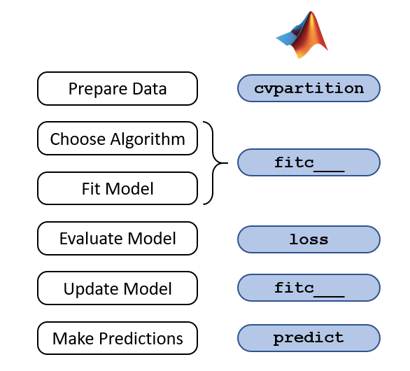

# Summary2

Author: Zhaojiacheng Zhou

由于整理自matlab英语课程，如果发现中英文有出入，请以英语版本为准

---

## Menu

1. Introduction
2. Classification Learner App
3. k Nearest Neighbor Classification
4. Classification Trees

---

### Introduction

- Typical machine learning workflow

---

### Classification Learner App

- Intro  
  “Classification Learner App”应用程序训练模型对数据进行分类。使用这个应用程序，可以使用各种分类器探索有监督的机器学习。

- 流程  
  1. 选择需要测试的模型or算法
  2. 用训练集训练模型
  3. 选择表现较好的几个算法
  4. 调整超参再次训练
  5. 分析原因

---

### k Nearest Neighbor Classification

- Intro  
  对新样本进行分类最直接的方法之一是找到与新样本相似的已知样本，并将新样本分配到同一类。这是k近邻分类的基本思想。  
  在使用这种方法时，我们不必对数据的底层分布做任何假设。
- 重要参数
  - NumNeighbors: Number of neighbors used for classification. (Default: 1)
  - Distance: Metric used for calculating distances between neighbors.
  - DistanceWeight: Weighting given to different neighbors.
  - Standardize: normalize the data

  The "cosine" distance metric works well for “wide” data (more predictors than observations) and data with many predictors.

---

### Classification Trees

- Intro

    机器学习中，决策树是一个预测模型；它代表的是对象属性与对象值之间的一种映射关系。树中每个节点表示某个对象，而每个分叉路径则代表的某个可能的属性值，而每个叶结点则对应从根节点到该叶节点所经历的路径所表示的对象的值。决策树仅有单一输出，若欲有复数输出，可以建立独立的决策树以处理不同输出。数据挖掘中决策树是一种经常要用到的技术，可以用于分析数据，同样也可以用来作预测。

- 重要步骤

  - 节点

    一个决策树包含三种类型的节点：
    1. 决策节点：通常用矩形框来表示
    2. 机会节点：通常用圆圈来表示
    3. 终结点：通常用三角形来表示

  - 剪枝

    剪枝是决策树停止分支的方法之一，剪枝有分预先剪枝和后剪枝两种。

    - 预先剪枝

        预先剪枝是在树的生长过程中设定一个指标，当达到该指标时就停止生长，这样做容易产生“视界局限”，就是一旦停止分支，使得节点N成为叶节点，就断绝了其后继节点进行“好”的分支操作的任何可能性。不严格的说这些已停止的分支会误导学习算法，导致产生的树不纯度降差最大的地方过分靠近根节点。

    - 后剪枝

        后剪枝中树首先要充分生长，直到叶节点都有最小的不纯度值为止，因而可以克服“视界局限”。然后对所有相邻的成对叶节点考虑是否消去它们，如果消去能引起令人满意的不纯度增长，那么执行消去，并令它们的公共父节点成为新的叶节点。这种“合并”叶节点的做法和节点分支的过程恰好相反，经过剪枝后叶节点常常会分布在很宽的层次上，树也变得非平衡。后剪枝技术的优点是克服了“视界局限”效应，而且无需保留部分样本用于交叉验证，所以可以充分利用全部训练集的信息。但后剪枝的计算量代价比预剪枝方法大得多，特别是在大样本集中，不过对于小样本的情况，后剪枝方法还是优于预剪枝方法的。

  - 优点

    决策树易于理解和实现

    数据准备简单，构建快速

    易于通过静态测试来对模型进行评测，可以测定模型可信度（如果给定一个观察的模型，那么根据所产生的决策树很容易推出相应的逻辑表达式）

  - 缺点

    1. 对连续性的字段比较难预测。
    2. 对有时间顺序的数据，需要很多预处理的工作。
    3. 当类别太多时，错误可能就会增加的比较快。
    4. 一般的算法分类的时候，只是根据一个字段来分类。

- 重要参数
  - SplitCriterion（分割准则）：用于确定每个级别的最佳分割的公式
  - MinLeafSize：每个叶节点的最小观测数
  - maxnumsplitting：决策树中允许的最大拆分数

- Tips

    当有大量数据丢失时，树是一个很好的选择
