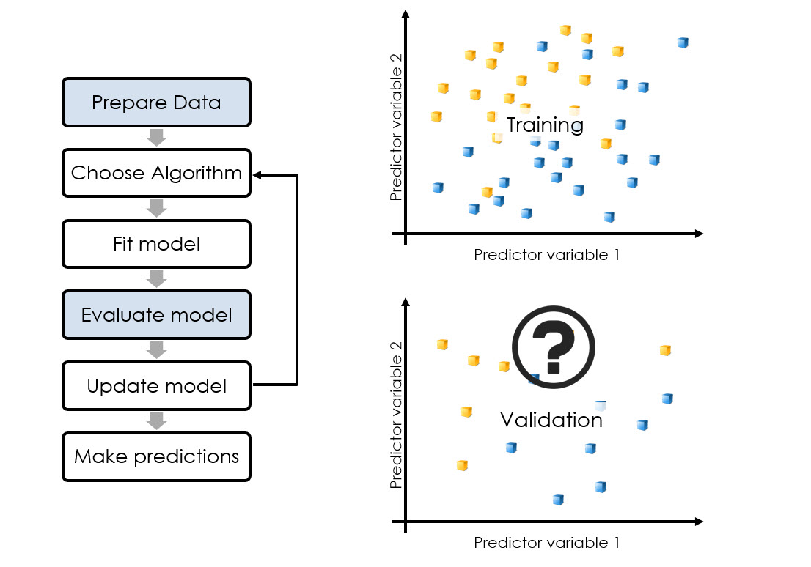

# Summary3

Author: Zhaojiacheng Zhou

由于整理自matlab英语课程，如果发现中英文有出入，请以英语版本为准

---

## Menu

1. Introduction

---

### Introduction

保留一部分数据用于验证模型拟合新数据的效果是一个好的尝试。但不同的分割可能会导致损失估计的改变。

每个算法都有可以修改的属性值，以提高性能。如何为数据集找到最佳属性值？

更简单的模型更容易解释，计算效率更高，不容易过度拟合。如何在不牺牲性能的前提下简化模型?

这章介绍的技术：

- 改进模型精度估计
- 降低模型复杂性
- 训练更精确的模型

---