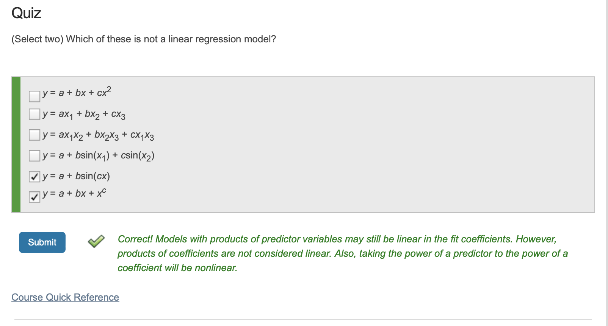

# Summary4

Author: Zhaojiacheng Zhou

由于整理自matlab英语课程，如果发现中英文有出入，请以英语版本为准

---

## Menu

1. Introduction
2. Linear Models

---

### Introduction

回归算法是一种有监督算法，用来建立“解释”变量(自变量X)和观测值(因变量Y)之间的关系；从机器学习的角度来讲，用于构建一个算法模型(函数)来做属性(X)与标签(Y)之间的映射关系，在算法的学习过程中，试图寻找一个函数 使得参数之间的关系拟合性最好。

回归算法中算法(函数)的最终结果是一个连续的数据值，输入值(属性值)是一个d维度的属性/数值向量

---

### Linear Models

- Intro

    线性回归是最简单但最强大的回归技术之一。这是一种参数回归技术，其中响应被建模为预测变量给出的一些已知公式。

    例如，可以使用以下公式将线性回归模型与燃油经济性数据拟合：

    $$ Fuel\space Economy=c_0+c_1*Weight+c_2*Horse\space Power+c_3*Axle\space Ratio$$

    在该模型中，燃油经济性是响应变量，而重量、马力和轴比是预测变量。

    拟合过程找到系数c0, c1, c2和c3，使预测误差最小化。

- Formula

    $$y=\displaystyle \sum_{k=0}^nc_k f_k\left(x_1,x_2\right)$$

    y是对应值，$x_1,x_2$是预测因子

- Grammar

    使用函数`fitlm`拟合线性回归模型

    ```matlab
    mdl = fitlm(data,"modelspec")
    ```

- Inputs

    |data|A table containing the data used to fit the regression model. See below for details.|
    |---|---|
    |"modelspec"|Specification of the regression model. See below for details.|

- Outputs

    |mdl|A regression model variable containing the coefficients and other information about the model.|
    |---|---|

- Tips

    fitlm的第一个输入是一个包含预测因子和对应值。默认情况下，fitlm使用最后一列作为对应值，所有其他列作为预测因子

    在对线性回归建模时，可以对预测变量应用不同的函数。作为fitlm的第二个输入，您可以使用一个预定义模型，也可以通过提供Wilkinson-Rogers表示法的公式来指定一个模型。

- Quiz

    

- Predefined Model

    |Model name|Meaning|
    |---|---|
    |"linear"|Intercept and linear terms for each predictor.|
    |"interactions"|Intercept, linear terms, and all products of pairs of distinct predictors (no squared terms).|
    |"quadratic"|Intercept, linear terms, interactions, and squared terms.|

- Wilkinson–Rogers notation: **responseVar ~ terms**

    |Operator|Meaning|Exampl|
    |---|---|---|
    |+|Include this term|"y ~ x1+x2"includes the intercept term(截距式), x1, and x2: $y = c_0 + c_1 x_1 + c_2 x_2$|
    |-|Exclude this term.|"y ~ x1+x2-1" excludes the intercept term: $y = c_1 x_1 + c_2 x_2$|
    |\*|Include product and all lower-order terms.|"y ~ x1\*x2" includes the intercept term, x1, x2, and x1*x2: $y = c_0 + c_1 x_1 + c_2 x_2 + c_3 x_1 x_2$|
    |:|Includes the product term only.|"y ~ x1:x2" includes only x1*x2:y = c1 x1 x2|
    |^|Include power and all lower-order terms.|"y ~ (x1^2)+(x2^2)" includes the intercept, x1, x2, x1^2, and x2^2: $y = c_0 + c_1 x_1 + c_2 x_2 + c_3 x_1^2 + c_4 x_2^2$|

- Sample Code

- Basic

    ```matlab
    mdl = fitlm(dataTrain,"quadratic","RobustOpts","on")
    yPred = predict(mdl,dataTest);
    ```

- Modify the code so that mdl fits a model where the response Y is a function of X1, X1^2, and X3.

    ```matlab
    mdl=fitlm(dataTrain,"Y~X1+X1^2+X3");
    yPred=predict(mdl,dataTest);
    ```
