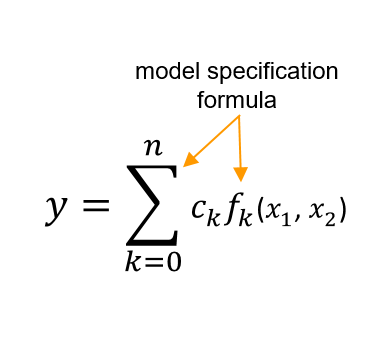
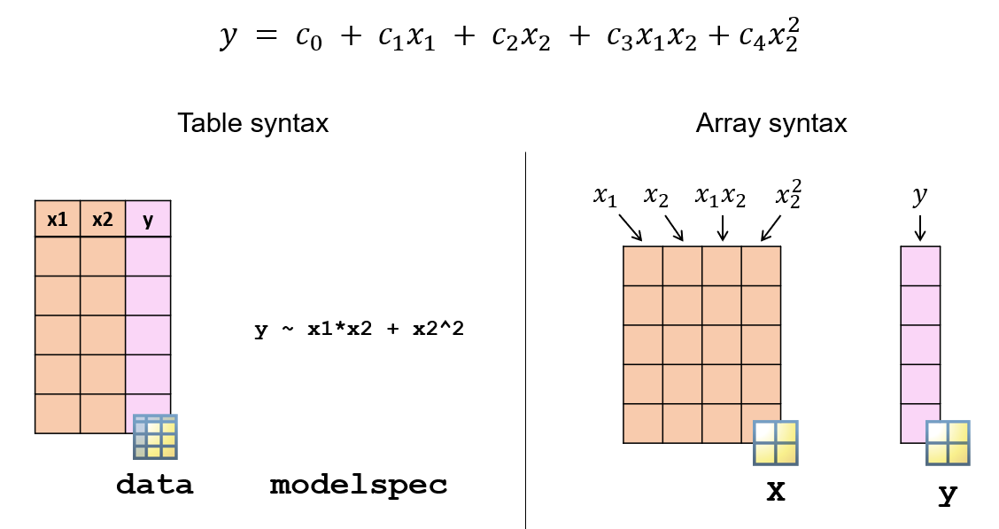
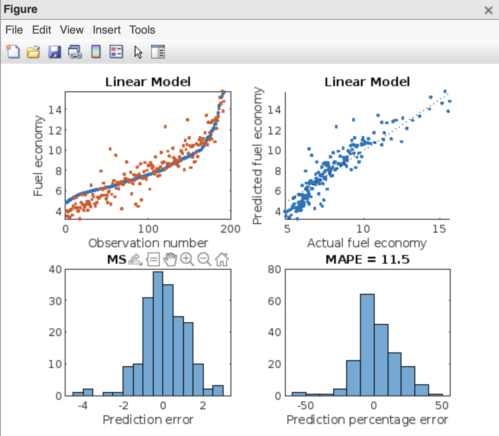
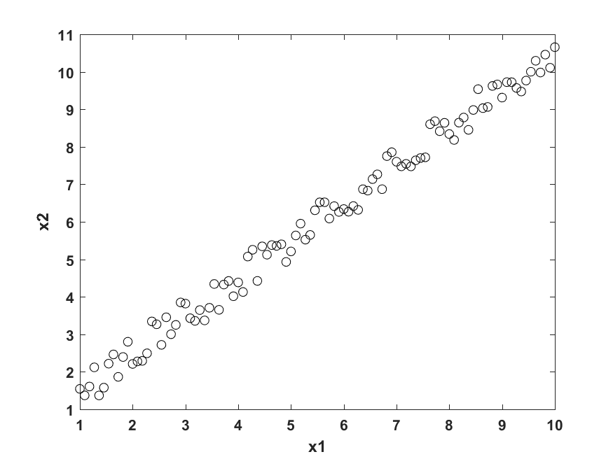
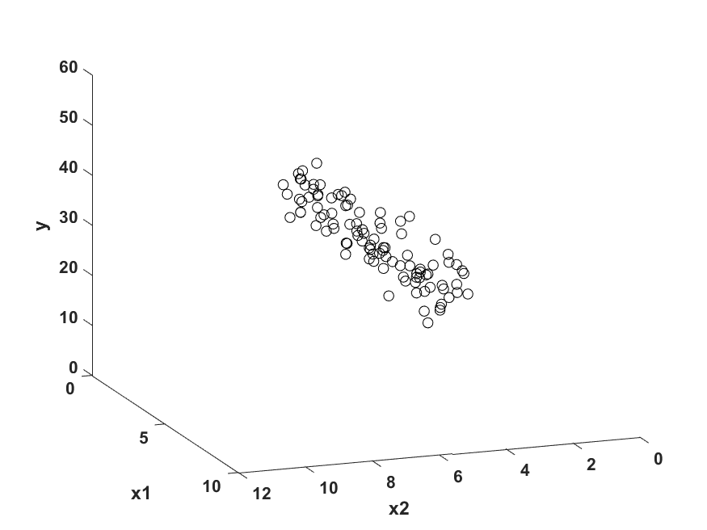
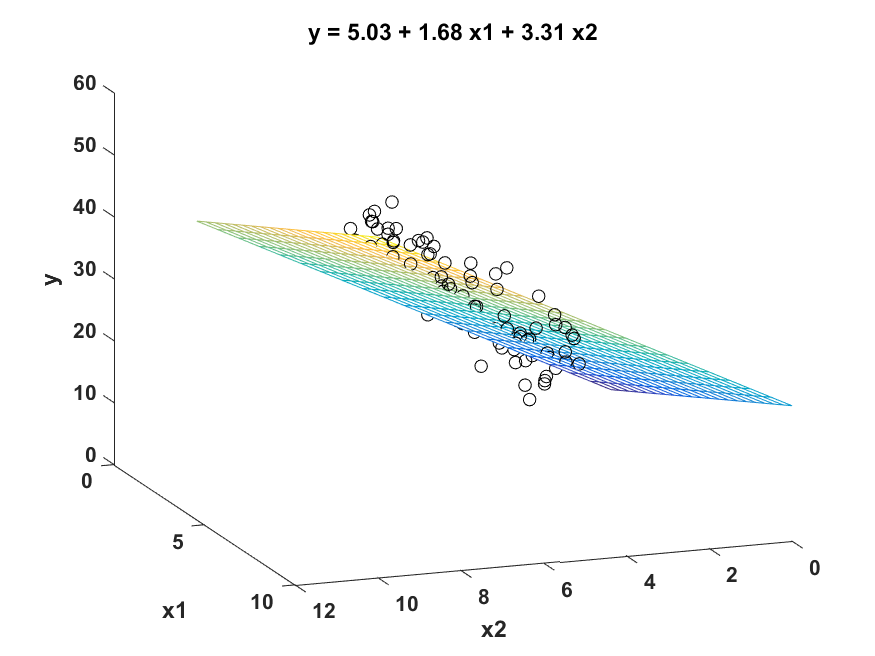
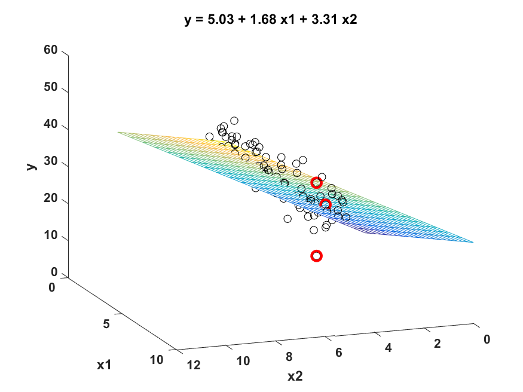
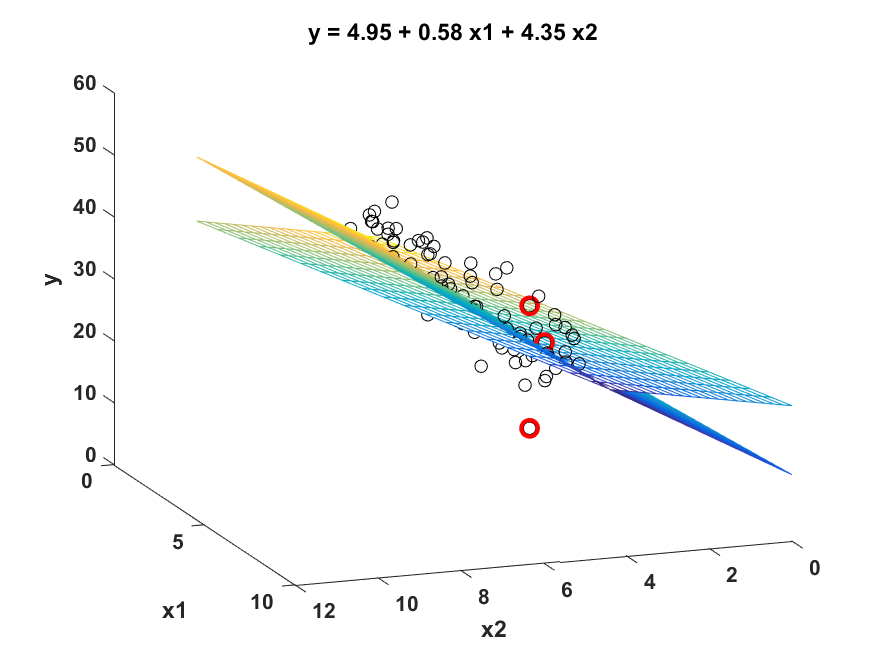
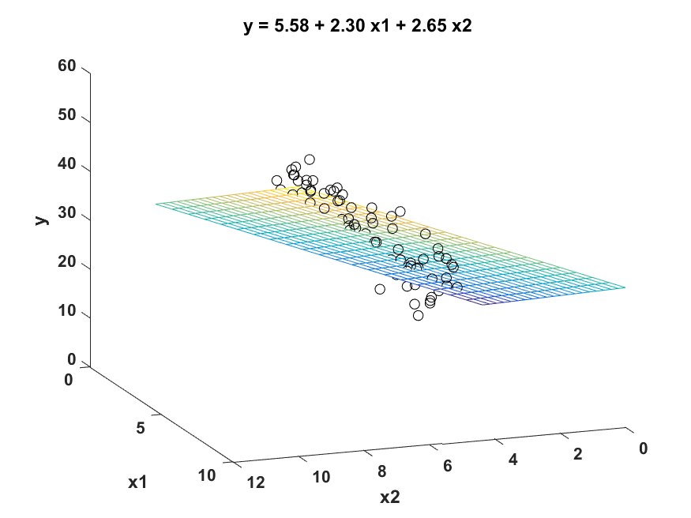
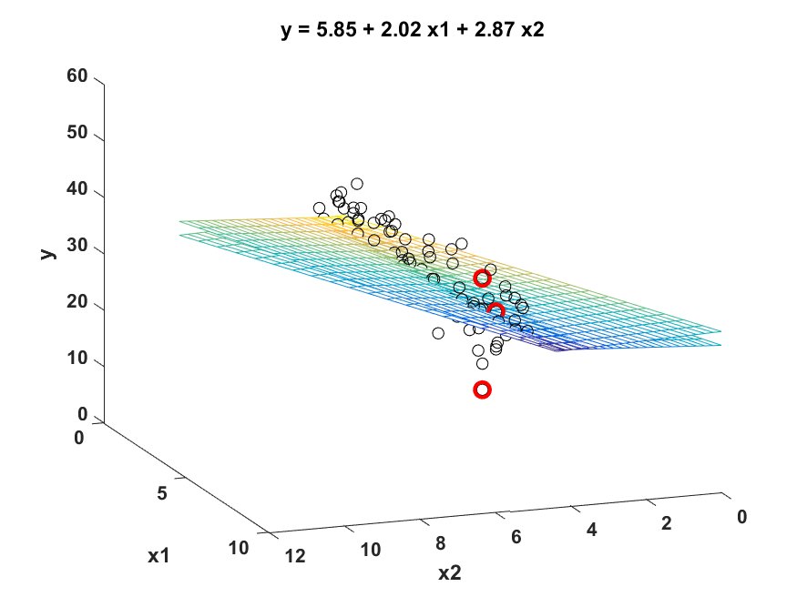

# Summary4

Author: Zhaojiacheng Zhou

由于整理自matlab英语课程，如果发现中英文有出入，请以英语版本为准

---

## Menu

1. Introduction
2. Linear Models
3. Stepwise Linear Regression
4. Regularized Linear Models

---

### Introduction

回归算法是一种有监督算法，用来建立“解释”变量(自变量X)和观测值(因变量Y)之间的关系；从机器学习的角度来讲，用于构建一个算法模型(函数)来做属性(X)与标签(Y)之间的映射关系，在算法的学习过程中，试图寻找一个函数 使得参数之间的关系拟合性最好。

回归算法中算法(函数)的最终结果是一个连续的数据值，输入值(属性值)是一个d维度的属性/数值向量

---

### Linear Models

- Intro

    线性回归是最简单但最强大的回归技术之一。这是一种参数回归技术，其中响应被建模为预测变量给出的一些已知公式。

    例如，可以使用以下公式将线性回归模型与燃油经济性数据拟合：

    $$ Fuel\space Economy=c_0+c_1*Weight+c_2*Horse\space Power+c_3*Axle\space Ratio$$

    在该模型中，燃油经济性是响应变量，而重量、马力和轴比是预测变量。

    拟合过程找到系数c0, c1, c2和c3，使预测误差最小化。

- Formula

    $$y=\displaystyle \sum_{k=0}^nc_k f_k\left(x_1,x_2\right)$$

    y是对应值，$x_1,x_2$是预测因子

- Grammar

    使用函数`fitlm`拟合线性回归模型

    ```matlab
    mdl = fitlm(data,"modelspec")
    ```

    

- Inputs

    |data|A table containing the data used to fit the regression model. See below for details.|
    |---|---|
    |"modelspec"|Specification of the regression model. See below for details.|

- Outputs

    |mdl|A regression model variable containing the coefficients and other information about the model.|
    |---|---|

- Tips

    fitlm的第一个输入是一个包含预测因子和对应值。默认情况下，fitlm使用最后一列作为对应值，所有其他列作为预测因子

    在对线性回归建模时，可以对预测变量应用不同的函数。作为fitlm的第二个输入，可以使用一个预定义模型，也可以通过提供Wilkinson-Rogers表示法的公式来指定一个模型。

- Quiz

    

- Predefined Model

    |Model name|Meaning|
    |---|---|
    |"linear"|Intercept and linear terms for each predictor.|
    |"interactions"|Intercept, linear terms, and all products of pairs of distinct predictors (no squared terms).|
    |"quadratic"|Intercept, linear terms, interactions, and squared terms.|

- Wilkinson–Rogers notation: **responseVar ~ terms**

    |Operator|Meaning|Exampl|
    |---|---|---|
    |+|Include this term|"y ~ x1+x2"includes the intercept term(截距式), x1, and x2: $y = c_0 + c_1 x_1 + c_2 x_2$|
    |-|Exclude this term.|"y ~ x1+x2-1" excludes the intercept term: $y = c_1 x_1 + c_2 x_2$|
    |\*|Include product and all lower-order terms.|"y ~ x1\*x2" includes the intercept term, x1, x2, and x1*x2: $y = c_0 + c_1 x_1 + c_2 x_2 + c_3 x_1 x_2$|
    |:|Includes the product term only.|"y ~ x1:x2" includes only x1*x2:y = c1 x1 x2|
    |^|Include power and all lower-order terms.|"y ~ (x1^2)+(x2^2)" includes the intercept, x1, x2, x1^2, and x2^2: $y = c_0 + c_1 x_1 + c_2 x_2 + c_3 x_1^2 + c_4 x_2^2$|

- Sample Code

  - Basic

      ```matlab
      mdl = fitlm(dataTrain,"quadratic","RobustOpts","on")
      yPred = predict(mdl,dataTest);
      ```

  - Modify the code so that mdl fits a model where the response Y is a function of X1, X1^2, and X3.

      ```matlab
      mdl=fitlm(dataTrain,"Y~X1+X1^2+X3");
      yPred=predict(mdl,dataTest);
      ```

- Specify the Regression Model

    预测矩阵X的每一列都被视为一个预测变量。默认情况下，fitlm将为每个预测器(列)拟合一个具有截距和线性项的模型。

    要拟合不同的回归公式有两个选择。
    1. 可以将预测器和响应存储在一个表中，并分别提供模型规范。
    2. 可以为回归公式中的每个项创建一个带有列的矩阵。这个矩阵叫做设计矩阵。

    

  - Sample Code for Design Matrix

    ```matlab
    XTrain13 = [XTrain(:,1),XTrain(:,3),XTrain(:,1).*XTrain(:,3)];
    dl13 = fitlm(XTrain13,yTrain)
    ```

  - Visualize the Result

    使用函数`evaluateFit`可视化模型

    ```matlab
    mdl = fitlm(carTrain,"RobustOpts","cauchy");
    econPred = predict(mdl,carTest);
    evaluateFit(carTest.FuelEcon,econPred,"Linear Model")
    ```

    

---

### Stepwise Linear Regression

- Intro

    在拟合线性回归模型时，可以使用无限多的模型规范。
    如何选择能创建最佳模型的模型规范?当你有大量的预测器时，这个问题会变得更糟。

    逐步线性回归通过选择预测变量的子集及其多项式函数来创建紧凑模型。

    注意`stepwise`仅在基础模型为线性回归时使用。对于非线性回归和分类问题，使用`sequentialfs`

- Grammar

    使用`stepwiselm`函数拟合线性回归模型

    ```matlab
    stepwiseMdl = stepwiselm(data,"modelspec")
    ```

  - Inputs

    |data|A table containing the data used to fit the regression model. See below for details.|
    |---|---|
    |"modelspec"|Starting model for the stepwise regression (see below).|

  - Outputs

    |stepwiseMdl|A linear model variable containing the coefficients and other information about the model.|
    |---|---|

  - Specify a Model
    可以通过以下输入来控制模型选择过程

    - "modelspec"——函数的第二个输入：指定起始模型。

      `stepwiselm`从这个模型开始，并根据某些标准添加或删除项。  
      常用的起始值:“constant”、“linear”、“interactions”(常数、线性、相互作用项)、“quadratic”(常数、线性、相互作用、二次项)。

    - "Lower" and "Upper"

      如果希望限制模型的复杂性，请使用这些属性。例如，下面的模型肯定包含截距和线性项，但不包含任何三次或三次以上的项

      ```matlab
      mdl = stepwiselm(data,"Lower","linear","Upper","quadratic") 
      ```

      默认情况下，`stepwiselm`认为模型简单如仅包含常数项或复杂如包含相互作用项

  - 选择模型

    如果修改后的模型比前一次迭代更好，则`stepwiselm`将迭代地从开始的模型中添加和减去项。

    “Better”是根据“Criterion”属性的值来判断的。默认值是“sse”——一个误差平方和的f检验。您可以通过设置“Criterion”属性来更改此选项。

    - Sample Code

      ```matlab
      mdl = stepwiselm(data,"Criterion","rsquared")
      ```
  
    可选值: "sse" (default), "aic", "bic", "rsquared", "adjrsquared"

  - Tips

    与`fitlm`一样，`stepwiselm`使用数据的最后一列作为响应，所有其他列作为预测因子。

  - Sample Code

    ```matlab
    mdl=stepwiselm(dataTrain,"purequadratic");
    yPred=predict(mdl,dataTest);

    % Extract the model formula 
    formula=mdl.Formula;
    ```

---

### Regularized Linear Models

- Intro

    当一个数据集有大量的预测因子时，选择正确的参数回归模型可能是一个挑战。包括所有的预测因素会创建一个不必要的复杂模型，而且一些预测因素可能是相关的。

    用线性回归模型拟合这类数据可以得到方差较大的系数。即训练数据稍有变化，系数值变化较大。

    

    考虑相关的预测因子x$_1$,x$_2$

    

    假定response，y,取决于x$_1$,x$_2$

    

    可以使用线性回归模型拟合数据

    

    理想情况下，该模型对训练数据的轻微变化具有鲁棒性。
    假设一些训练数据点发生了轻微的变化。

    

    当一个线性回归模型适合新的数据时，可以直观地观察到新模型与旧模型有很大的不同。

  - 正则化

    正则化线性回归模型通过对较大的系数值施加惩罚来缩小回归系数。这减少了系数的方差，并可以创建预测误差较小的模型。

    

    这是原始训练数据的正则化线性回归模型。这些系数与线性模型中的系数相似。

    

    在训练数据发生轻微变化后，可以观察到正则化回归模型的系数变化不大。

  - Ridge and Lasso Regression

